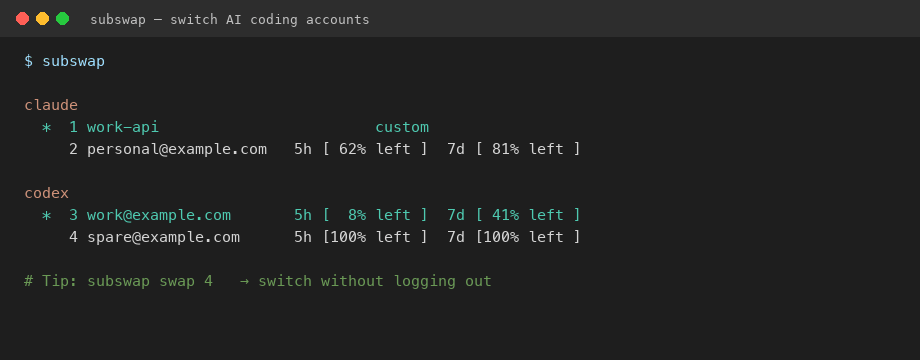
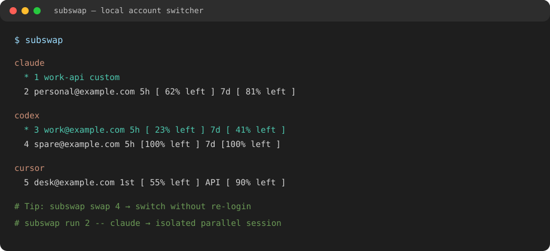
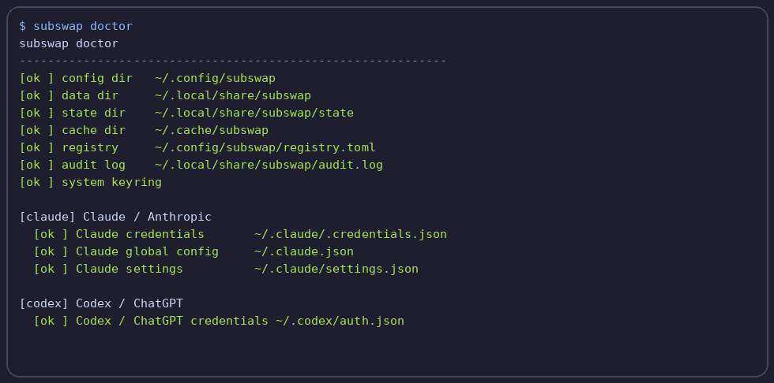

<p align="center">
  <a href="README.md"></a>
  <a href="README.zh-CN.md"></a>
  <a href="README.ja.md"></a>
  <a href="README.ko.md"></a>
</p>

<h1 align="center">subswap</h1>

<p align="center"><strong>Switch work and personal Claude Code, ChatGPT, Codex, and Cursor accounts without logging out.</strong></p>

<p align="center">Keep several AI coding logins on one machine. See which account still has usage left, then switch in one command — no browser dance.</p>

<p align="center">
  <a href="https://github.com/x0c/subswap/actions/workflows/ci.yml"></a>
  <a href="https://github.com/x0c/subswap/actions/workflows/release.yml"></a>
  <a href="LICENSE"></a>
</p>

<p align="center">
  
</p>
<p align="center"><em>Sample demo with example accounts — not a recording of your machine.</em></p>

<p align="center">
  
</p>

## Install

On **macOS or Linux with Homebrew**:

```bash
brew install x0c/tap/subswap
subswap
```

<details>
<summary>Windows / GitHub Release / from source</summary>

**Windows**

```powershell
irm https://raw.githubusercontent.com/x0c/subswap/main/install.ps1 | iex
```

The installer downloads the latest Windows release, verifies its SHA-256 checksum, and adds `subswap.exe` to your user `PATH`. You can also download the zip and checksum from the [latest release](https://github.com/x0c/subswap/releases/latest).

**GitHub Release (any OS)**

Download from the [latest release](https://github.com/x0c/subswap/releases/latest) and verify the accompanying SHA-256 file before installing.

**From source** (Rust 1.80+, for development)

```bash
git clone https://github.com/x0c/subswap
cd subswap
cargo install --path crates/cli
subswap --help
```

Prefer Homebrew or a release asset for normal use.

</details>

## What you can do

- **Keep work, personal, and client accounts separate** — switch Claude Code, ChatGPT, Codex, and Cursor without logging out and back in.
- **See remaining headroom** — Claude, Codex, Kimi, Cursor, OpenCode, and Command Code quota windows in one list.
- **Switch offline when you must** — manual `swap` never waits on a network or quota API; auto-swap is optional.
- **Run a second account in parallel when it is safe** — Claude, Codex, Kimi, OpenCode, and Command Code isolation without changing the global active login.
- **Cursor on the desktop** — import, switch, and quota; Cursor does not support isolated `run` / `shell` / `env`.

## First use

Sign in to a supported client first, then:

```bash
subswap autoswap off   # stay manual while you try it
subswap                # import local logins and list accounts
subswap swap 2         # use a number from your list
```

<details>
<summary>More import / login / isolated-run examples</summary>

```bash
subswap login kimi
subswap login cursor
subswap login opencode
subswap login commandcode
subswap login claude
subswap login codex

subswap swap alice@example.com
subswap swap claude/alice@example.com

subswap run codex bob@example.com -- --version
subswap shell claude/alice@example.com
eval "$(subswap env codex/bob@example.com)"
```

</details>

<details>
<summary>Supported clients</summary>

| Client | Import and switch | Quota and auto-swap | Isolated run | Important boundary |
|---|---:|---:|---:|---|
| Claude Code | Yes | Yes | Yes | Custom API endpoints are manual-only. |
| Codex CLI / ChatGPT | Yes | Yes | Yes | Quota lookup uses the official app-server channel. |
| Kimi Code | Yes | Yes | Yes | Sign in with the native client, then import. |
| Cursor desktop | Yes | Yes | No | Switching coordinates a desktop-app restart and its SQLite state. |
| OpenCode Go | Yes | Yes | Yes | Only the `opencode-go` entry is changed; other entries stay untouched. |
| Command Code | Yes | Yes | Yes | Switches `~/.commandcode/auth.json`; quota via `/alpha/billing/credits`. |

The CLI is tested in CI on macOS, Linux, and Windows. The background daemon is Unix-only: it auto-starts on Linux, requires explicit opt-in on macOS, and is unavailable on Windows.

</details>

<details>
<summary>Environment check (`subswap doctor`)</summary>

<p align="center">
  
</p>

</details>

## Before you start

- Use only accounts that you own or are authorized to use. subswap does not share credentials, bypass service limits, or make any upstream account policy compliant.
- Cursor cannot be used in an isolated run because its identity is desktop-app state; a Cursor swap coordinates closing and reopening the app.
- On Linux, the first `subswap` run starts a single background daemon for quota checks and optional auto-swap. On macOS, set `SUBSWAP_AUTO_DAEMON=1` to opt in. Set `SUBSWAP_NO_DAEMON=1` to disable it entirely.
- Credential data stays in the application data directory. On macOS and Linux, private credential files are forced to `0600`; Windows relies on the current user's application-data permissions.

## Safety guarantees

1. **Manual switching stays available offline.** Quota data is advisory: network trouble or an expired token does not stop `subswap swap` from attempting the local switch.
2. **Switches are transactional.** subswap takes a private snapshot before changing native client state and rolls back if a target write fails.
3. **Automatic switching has guardrails.** Manual-only accounts are never selected automatically; a settle period preserves a just-made manual choice; unknown or failed quota data is handled conservatively.
4. **Native clients keep their own safety boundary.** Codex refreshes through its official app-server, Cursor coordinates its desktop lifecycle, and unsupported refresh states fail safely instead of racing a one-time token.

## FAQ

### Does a manual swap call quota APIs?

No. `subswap swap` is the network-independent escape hatch.

### Where are credentials stored?

Private credential data is stored in the subswap application-data directory, separate from account metadata. On Unix, credential and snapshot files use `0600` permissions. Custom Claude API mode also needs its API key in Claude Code's settings; subswap restores the managed settings when you switch back to OAuth.

### Can I turn off automatic switching?

Yes. Run `subswap autoswap off`, or disable the background daemon with `SUBSWAP_NO_DAEMON=1`.

### Does Cursor work like the command-line clients?

Not completely. Cursor supports import, switching, and quota status, but not `run`, `shell`, or `env` isolation because its identity is coordinated with the desktop application's SQLite state.

### Is this only for Claude or Codex?

No. Claude Code, Codex / ChatGPT, Kimi Code, Cursor, OpenCode Go, and Command Code are supported today.

## Contributing and security

Read [CONTRIBUTING.md](CONTRIBUTING.md) for the supported contribution paths and local checks. Do not open a public issue with credentials, refresh tokens, login files, real email addresses, or billing screenshots. See [SECURITY.md](SECURITY.md) for private vulnerability reporting.

If subswap saves you from logging out all day, [star the repo](https://github.com/x0c/subswap) so you can find it again later.

## License

MIT — see [LICENSE](LICENSE).
