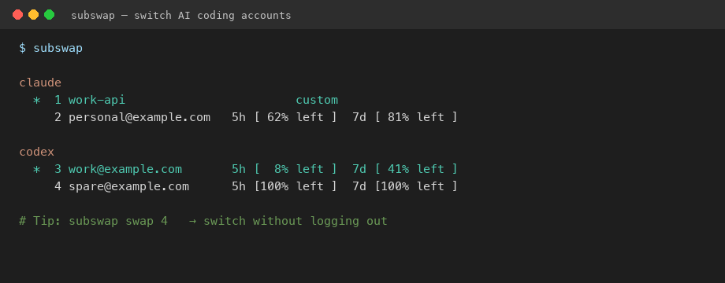
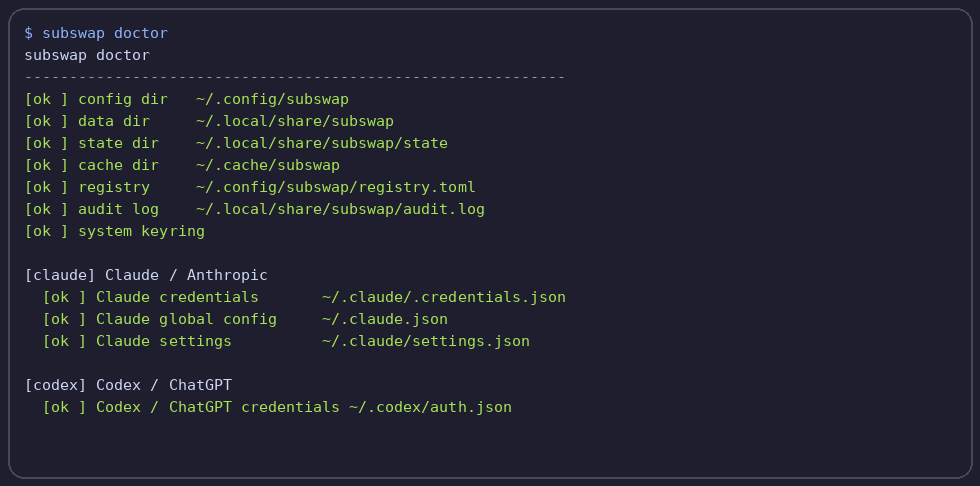

<p align="center">
  <a href="README.md"></a>
  <a href="README.zh-CN.md"></a>
  <a href="README.ja.md"></a>
  <a href="README.ko.md"></a>
</p>

<h1 align="center">subswap</h1>

<p align="center"><strong>查看剩余额度，切换 AI 编程工具账号。</strong></p>

<p align="center">管理 Claude Code、Codex、Kimi Code、Cursor、OpenCode 和 Command Code 的已保存登录。查看哪个账号还有额度，再用一条命令切换。</p>

<p align="center">
  <a href="https://github.com/x0c/subswap/actions/workflows/ci.yml"></a>
  <a href="https://github.com/x0c/subswap/actions/workflows/release.yml"></a>
  <a href="LICENSE"></a>
</p>

<p align="center">
  
</p>
<p align="center"><em>使用示例账号的演示。</em></p>

## 安装

在 **macOS 或 Linux，且已安装 Homebrew** 时：

Linux 预编译包需要 glibc 2.39 或更新版本；较旧系统请从源码构建。

```bash
brew install x0c/tap/subswap
subswap --help
```

<details>
<summary>Windows / 预编译包下载 / 从源码安装</summary>

**Windows**

```powershell
irm https://raw.githubusercontent.com/x0c/subswap/main/install.ps1 | iex
subswap --help
```

安装器会下载最新 Windows Release、校验 SHA-256，并将 `subswap.exe` 加入当前用户的 `PATH`。也可以从[最新 Release](https://github.com/x0c/subswap/releases/latest)手动下载 zip 与校验和。

**预编译包下载**

[最新 Release](https://github.com/x0c/subswap/releases/latest)提供 macOS（Apple silicon / Intel）、Linux（ARM64 / x64）和 Windows（x64）安装包。安装前请核对随附的 SHA-256 校验和。

**从源码安装**（使用当前稳定版 Rust，适合开发）

```bash
git clone https://github.com/x0c/subswap
cd subswap
cargo install --locked --path crates/cli
subswap --help
```

日常使用优先选择 Homebrew 或 Release 附件。

</details>

## 第一次使用

先安装并登录需要使用的原生客户端。自动换号默认开启；先切到手动模式，由你决定使用哪个账号：

```bash
subswap autoswap off
subswap                # 保存本机登录并显示账号与额度
```

切换前先保存另一个账号。Claude Code 和 Codex 可以由 subswap 启动原生登录流程：

```bash
subswap login codex    # 登录另一个 Codex 账号；Claude Code 使用 claude
subswap swap 2         # 将 2 替换为账号列表中显示的编号
```

Kimi Code、Cursor 和 Command Code 需要先在原生客户端登录另一个账号，再用 `subswap login kimi`、`subswap login cursor` 或 `subswap login commandcode` 保存。`subswap login opencode` 导入官方 Console 账号，必要时启动官方登录流程；`subswap login opencode-api-key` 将 Go API Key 导入独立列表。

切换 Codex 后，请重启已运行的 Codex CLI 会话，或重载 IDE 窗口后打开新会话。已有进程可能仍使用原来的账号。切换 Cursor 桌面版时，若应用正在运行，subswap 会关闭并重新打开它。

<details>
<summary>更多命令</summary>

```bash
subswap swap alice@example.com
subswap swap claude/alice@example.com

subswap add-api         # 添加 Claude Code 兼容 API 端点
subswap autoswap on     # 开启自动换号
subswap autoswap off    # 回到手动模式
subswap doctor         # 检查本机路径与客户端配置

subswap run codex bob@example.com -- --version
subswap shell claude/alice@example.com
eval "$(subswap env codex/bob@example.com)"
```

</details>

## 功能

- **切换已保存账号** — 使用 `subswap swap <编号>` 选择账号，减少每次切换时重新登录的操作。
- **查看额度与重置时间** — 汇总支持客户端的剩余用量，也显示 Codex reset 的可用次数及服务提供的到期时间。
- **使用自定义 Claude Code API** — 用 `subswap add-api` 添加 Anthropic 兼容端点；这类账号仅手动选择。
- **并行使用另一个账号** — 对支持隔离运行的客户端使用 `run`、`shell` 或 `env`，保留全局当前登录。
- **开启自动换号** — 达到设定的额度条件时，由 subswap 选择另一个已保存账号。

## 支持的客户端

| 客户端 / 账号类型 | 导入与切换 | 额度 | 自动换号 | 隔离运行 | 说明 |
|---|---:|---:|---:|---:|---|
| Claude Code（OAuth） | 是 | 是 | 是 | 是 | 自定义 API 端点仅手动选择。 |
| Codex（ChatGPT 登录） | 是 | 是 | 是 | 是 | 全局切换后需重启已有 Codex 会话。 |
| Kimi Code | 是 | 是 | 是 | 是 | 先在原生客户端登录，再导入。 |
| Cursor 桌面版 / CLI | 是 | 是 | 是 | 否 | 桌面版切换会协调应用重启。 |
| OpenCode Console | 是 | 是 | 是 | 否 | 自动换号仅在官方 Console 账号之间进行。 |
| OpenCode Go API Key | 是 | 是 | 否 | 仅 V1 | V2 通过官方客户端选择 Key。 |
| Command Code | 是 | 是 | 是 | 是 | 先在原生客户端登录，再导入。 |

CLI 已在 macOS、Linux 和 Windows CI 中测试。请安装需要使用的原生客户端。同一账号在多个会话中同时刷新凭证时，可能需要重新登录；并行使用时尽量选择不同的已保存账号。

## 自动换号

`subswap autoswap off` 会同时关闭默认命令与后台进程的自动换号；`subswap autoswap on` 则开启。手动选择账号后有可配置的保持期，期间暂停自动换号。

当前账号的额度仍在查询、查询失败或缓存已过期时，会保留当前账号。通常，达到额度阈值后会选择一个可用账号。若当前账号已确认耗尽，且没有确认可用的目标，也可能选择一个已确认耗尽、但恢复更早的账号。阈值与时间设置见[配置说明](docs/CONFIG.md)。

后台进程仅支持 Unix。Linux 在运行 `subswap` 时自动启动；macOS 需要设置 `SUBSWAP_AUTO_DAEMON=1`；Windows 使用前台 CLI。`SUBSWAP_NO_DAEMON=1` 只阻止自动启动后台进程，不会停止已运行的进程，也不会关闭默认命令中的自动换号。

<details>
<summary>环境自检（`subswap doctor`）</summary>

<p align="center">
  
</p>

</details>

## 凭证

已保存凭证以明文文件存放在 subswap 的用户应用数据目录，与账号元数据分开。macOS 和 Linux 上的私有凭证与快照文件使用 `0600` 权限；Windows 依赖当前用户的应用数据权限。`subswap doctor` 可查看实际路径。原生客户端也保留自己的当前凭证。自定义 Claude API 模式会将 API Key 写入 Claude Code 设置；切回 OAuth 时恢复进入 API 模式前的受管设置。

请只管理你拥有或被授权使用的账号。

## 常见问题

### 手动切换依赖额度接口吗？

切换账号本身不依赖额度查询。切换成功后会打印额度表；缓存过旧时，这一步可能发起网络查询。额度查询失败不会撤销已完成的账号切换。不指定目标的 `subswap swap` 只列出已保存账号，不查额度。

### 会修改 ChatGPT 网页版的登录吗？

subswap 管理的是 Codex 使用的 ChatGPT 登录凭证，ChatGPT 浏览器会话独立于它。

### Cursor 可以使用 `run`、`shell` 或 `env` 吗？

Cursor 可通过桌面版或 CLI 凭证进行导入、切换与额度查询，不支持这些隔离运行命令。

## 贡献与安全

贡献路径与本地检查见 [CONTRIBUTING.md](CONTRIBUTING.md)。请勿在公开 Issue 中贴凭证、refresh token、登录文件、真实邮箱或账单截图。漏洞私下报告见 [SECURITY.md](SECURITY.md)。

如果 subswap 对你有帮助，可以给仓库[点个 star](https://github.com/x0c/subswap)，方便以后找到。

## 许可证

MIT — 见 [LICENSE](LICENSE)。
